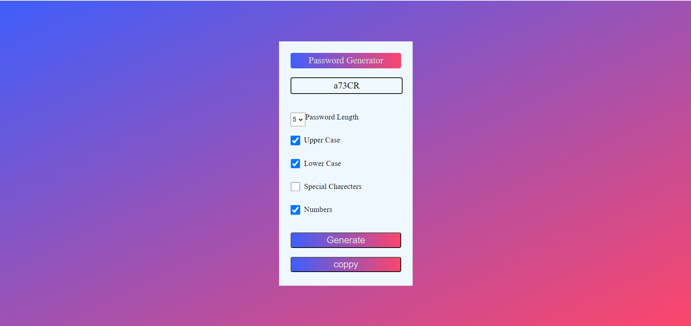

# Password Generator

A simple password generator built using HTML, CSS, and JavaScript. This tool allows users to generate a random password based on selected criteria such as password length, inclusion of uppercase letters, lowercase letters, numbers, and special characters.

## Features

- **Password Length**: Choose the desired length of the password.
- **Character Types**: Select from uppercase letters, lowercase letters, numbers, and special characters.
- **Copy Functionality**: Easily copy the generated password to your clipboard.

## Demo



## Usage

1. Clone the repository:
   ```bash
   git clone https://github.com/Chanikyachalla/Password-Generator.git

## How It Works

+ Password Length: Use the dropdown to select the desired length of the password.
Character Type Selection: Check the boxes to include uppercase letters, lowercase letters, numbers, and/or special characters in the generated password.
+ Generate Password: Click the "Generate" button to create a random password based on your selections.
+ Copy Password: Click the "Copy" button to copy the generated password to your clipboard.


## How to Contribute
+ Contributions are welcome! If you have any ideas, suggestions, or issues, feel free to open an issue or submit a pull request.
